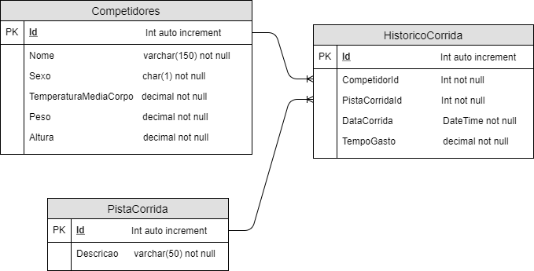

# Adventure Works Basic Level

Este é um projeto para medir seus conhecimentos práticos em .Net Core.
Leia atentamente o **README** deste projeto para conseguir realizá-lo.
Boa sorte! :)

O Projeto `AdventureWorks` é uma `API REST` em `.net core` na linguagem `C#`.
Ela já está criada para você continuar o desenvolvimento.
Todo o backend da aplicação deverá ser a `API REST AdventureWorks`.

**Para o desenvolvimento, siga os passos a seguir.**

*   Depois de realizar o clone do projeto em seu local de trabalho, crie uma branch chamada `branch_<seu_nome>`. Todo o desenvolvimento deverá ser feito nesta branch. O `commit` e o `push` deverá ser realizado nesta branch.
*   Os scripts de banco de dados deverão estar também no projeto em uma pasta chamada `sql_scripts`.
*   Os `commits` deverão ser realizados nesta branch criada.
*   Para efetivar sua participação neste projeto o `push` deverá ser realizado e não é necessário realizar o `merge` com a branch `master`.

*Será um diferencial (não obrigatório) caso trabalhe com containers (Docker / Docker-Compose), React, AngularJS.*

**Para rodar ou realizar o build no projeto pré-criado, siga as opções a seguir:**

**No Visual Studio Code:**
*  Para `Build`: executar a tarefa (task) `build`
*  Para executar em modo `Debug`: somente pressionar `F5`
*  Para executar sem ser modo `Debug`: executar o projeto `AdventureWorks.Api.csproj` com  `dotnet run`

Após executar o projeto `AdventureWorks.Api`, certificar que ele está rodando indo no browser e executando `http://localhost:5000/api/hello`. Deverá aparecer a mensagem *"Hello from IOB Sage Adventure Works!"*.

---

**O Projeto**

O `AdventureWorks` é um sistema de controle de competições de corrida. Ele armazena o registro de competidores e o histórico de corridas (em cada pista) que cada competidor participou.
Abaixo, você pode visualizar o MER das tabelas para o banco de dados.

Abaixo temos os requisitos funcionais solicitados pela equipe de négócio:

* [ ]  Deverá conter o cadastro completo (CRUD) dos competidores.
* [ ]  Deverá conter o cadastro completo (CRUD) das pistas.
* [ ]  Deverá conter o cadastro (inclusão e alteração) do histórico de corrida para os competidores.
* [ ]  O sistema deverá conter a listagem de quais pistas já foram utilizadas.
* [ ]  O sistema deverá conter a listagem dos competidores com o *tempo médio* gasto nas corridas.
* [ ]  O sistema deverá conter a listagem dos competidores que *não* fizeram nenhuma corrida.

Abaixo temos os requisitos não funcionais que decidimos em nossa equipe de tecnologia:

* [ ] O back-end deverá ser via `REST API` em `.net core` utilizando o projeto `AdventureWorks` já pré criado.
* [ ] O front-end deverá ser em `MVC`, `React` ou `AngularJS`.
* [ ] O banco de dados deverá ser em `Sql Server` ou `MySql`.

---

Lhe desejamos um bom projeto! :D